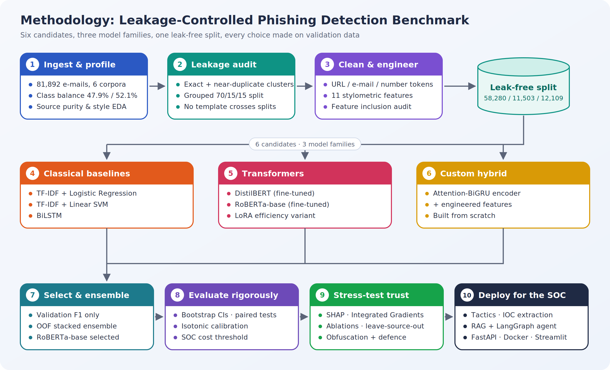
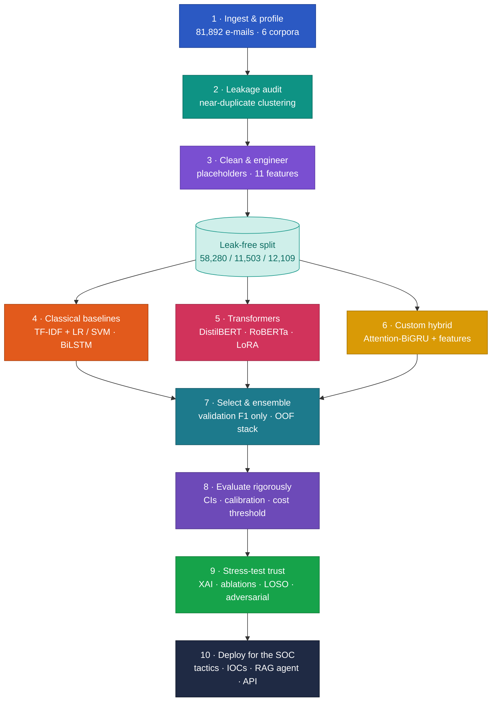
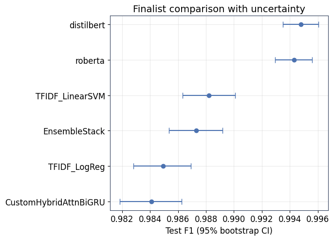
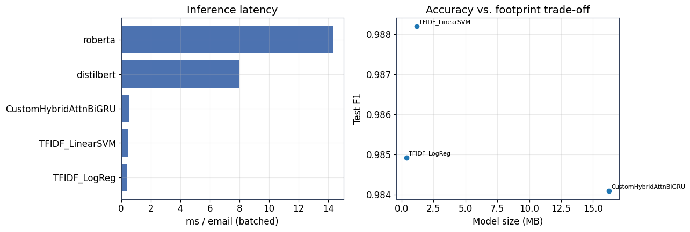
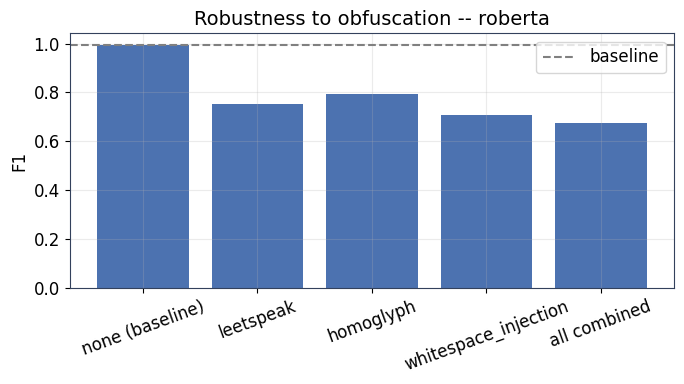
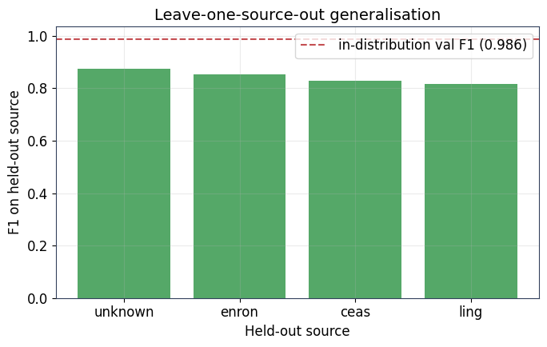

# Phishing E-mail Detection: A Leakage-Controlled Benchmark

How good are phishing detectors **really**, once data leakage is removed, selection is done on validation data only, and the models are stress-tested against unseen sources and obfuscation attacks? This project benchmarks **six models from three families** on **81,892 e-mails**, selects a champion with a strict validation-only protocol, and turns it into analyst-facing SOC tooling.

> MSc Data Science final project, University of Hertfordshire. All results come from one complete run on a Kaggle Tesla T4 GPU.

---

## Highlights

| | |
|---|---|
| **Best model** | Fine-tuned **RoBERTa-base**, selected on validation F1 (0.9931) |
| **Held-out test** | **F1 0.9943** (95% CI 0.9929-0.9956) · ROC-AUC 0.9997 · 12,109 e-mails |
| **Leak-free data** | Exact + near-duplicate templates clustered; no template appears in two splits |
| **Statistical rigour** | Bootstrap CIs, paired significance tests, isotonic calibration (Brier 0.00534 → 0.00429) |
| **SOC-aware** | Cost-optimal threshold cuts missed phishing e-mails on test from **42 to 23** |
| **Robustness** | Character-normalisation defence lifts F1 under combined obfuscation from **0.673 to 0.824** |
| **Deployment** | FastAPI + Docker + Streamlit service and a LangGraph + RAG SOC agent |

## Methodology

**[Explore the interactive methodology](https://spoorthihs4-ops.github.io/phishing-detection-benchmark/)** – click any stage to see what it does, why it matters, the result it produced and the techniques behind it.

<b>Pipeline as a live diagram (zoom and pan on GitHub)</b>

## Results

### Five finalists on the held-out test set

| Model | Validation F1 | Test F1 (95% CI) | Test recall | ROC-AUC | Training time | Batched latency |
|---|---|---|---|---|---|---|
| **RoBERTa-base** (selected) | **0.9931** | 0.9943 (0.9929-0.9956) | 0.9933 | 0.9997 | 80 min | 14.3 ms |
| DistilBERT | 0.9920 | 0.9948 (0.9935-0.9960) | 0.9953 | 0.9997 | 38 min | 8.0 ms |
| TF-IDF + Linear SVM | 0.9894 | 0.9882 (0.9863-0.9901) | 0.9886 | 0.9992 | 6 s | 0.49 ms |
| TF-IDF + Logistic Regression | 0.9859 | 0.9849 (0.9828-0.9869) | 0.9862 | 0.9987 | 8 s | 0.42 ms |
| Custom Attention-BiGRU + features | 0.9852 | 0.9841 (0.9818-0.9863) | 0.9833 | 0.9976 | 9 min | 0.55 ms |

The two Transformers are statistically tied (paired bootstrap p = 0.50). The model is chosen on **validation** F1, so DistilBERT's fractionally higher test score plays no part in selection.

  
  

### What the stress tests showed

| Test | Finding |
|---|---|
| Leave-one-source-out | F1 drops from 0.986 to **0.82-0.88** on a corpus never seen in training - in-distribution scores flatter every model |
| Source artefacts | Corpus identifiers such as `enron` rank among the most influential SHAP tokens |
| Obfuscation attacks | Leetspeak, homoglyphs and whitespace injection together cut F1 from 0.992 to **0.673** |
| Normalisation defence | Recovers F1 to **0.824** combined, and fully neutralises homoglyphs (0.992) |
| Architecture ablation | Attention pooling and fused engineered features add no measurable gain (all within 0.002 F1) |
| Cost-aware threshold | 25:1 miss-to-false-alarm cost: validation cost −20.2%, test misses 42 → 23 for 5 extra false alarms |

  
  

### SOC extensions

- **Social-engineering tactics:** urgency, authority, fear, reward and scarcity detected with per-tactic tuned thresholds (test F1 0.74-0.88).
- **Indicators of compromise:** 1,386 unique URLs, domains, e-mail addresses and IPs extracted from flagged e-mails.
- **LangGraph + RAG agent:** BM25 retrieval over a curated cyber-security knowledge base (recall@4 0.90, MRR 0.95), explicit risk scoring and a groundedness check that rejects unsupported explanations. The captured run used a template explainer because no LLM API key was set, so agent explanation quality is not yet measured.

## Notebooks

The study is split into seven notebooks that keep the executed outputs of the full run, plus the complete pipeline for reproduction.

| Notebook | Contents |
|---|---|
| [`00_full_pipeline_run_all`](00_full_pipeline_run_all.ipynb) | **Everything, top to bottom - run this to reproduce** |
| [`01_data_eda_and_leakage_safe_split`](01_data_eda_and_leakage_safe_split.ipynb) | Data loading, EDA, leakage audit, grouped split, cleaning, feature engineering |
| [`02_model_development_and_ensembles`](02_model_development_and_ensembles.ipynb) | Evaluation harness, baselines, Transformers, LoRA, custom hybrid, ensembles |
| [`03_statistical_evaluation_calibration_xai`](03_statistical_evaluation_calibration_xai.ipynb) | Bootstrap CIs, model selection, error analysis, calibration, thresholds, SHAP, Integrated Gradients |
| [`04_threat_intelligence_tactics_and_iocs`](04_threat_intelligence_tactics_and_iocs.ipynb) | Social-engineering tactic detection and IOC extraction |
| [`05_ablation_generalisation_robustness`](05_ablation_generalisation_robustness.ipynb) | Ablations, leave-one-source-out, source-artefact test, adversarial attacks and defence |
| [`06_rag_latency_deployment_soc_agent`](06_rag_latency_deployment_soc_agent.ipynb) | RAG explanations, latency benchmark, FastAPI/Docker/Streamlit, LangGraph SOC agent |
| [`07_conclusions_report_dashboard`](07_conclusions_report_dashboard.ipynb) | Research-question answer, limitations, HTML report, interactive dashboard |

## Reproduce

1. Open [`00_full_pipeline_run_all.ipynb`](00_full_pipeline_run_all.ipynb) on **Kaggle** with a **GPU T4** accelerator and Internet enabled.
2. Attach the dataset (pre-split `train.csv` / `val.csv` / `test.csv`, or one raw CSV with `text` and `label` columns; see Section 2).
3. **Run All.** `QUICK_RUN = True` in Section 1 gives a fast smoke test; the full run takes a few hours on a T4 (RoBERTa fine-tuning alone is about 80 minutes).

To try the lightweight API, see [`DEPLOYMENT.md`](DEPLOYMENT.md).

## Data

81,892 e-mails pooled from six public corpora: CEAS-08 (38,963), Enron (29,423), an unlabelled-source residual (5,802), Nigerian Fraud (3,293), Ling (2,859) and Nazario (1,552). The data is not stored in this repository.

## Limitations

- The corpora are older spam and legitimate-mail collections; two sources are 100% phishing, so part of the in-distribution score reflects corpus identity.
- Each model was trained once (one seed); bootstrap intervals capture test-set noise, not training variance.
- The obfuscation defence is non-adaptive, and the SOC agent's LLM explanations still need evaluation with a real model and a larger labelled set.

## Repository structure

All files sit in the repository root so they upload and display correctly:

- `00_full_pipeline_run_all.ipynb` – the complete pipeline (run this to reproduce)
- `01_…` onwards – part notebooks with executed outputs
- `methodology_flowchart.png` and the result charts shown above
- `index.html` – interactive methodology page (GitHub Pages)
- `requirements.txt`, `.gitignore`
- `app.py`, `streamlit_app.py`, `Dockerfile`, `requirements-api.txt`, `deploy_config.example.json` – reference deployment (see `DEPLOYMENT.md`)

## Author

**Dr. Spoorthi H S** · MSc Data Science, University of Hertfordshire  
[LinkedIn](https://linkedin.com/in/dr-spoorthi-2005b6351) · [GitHub](https://github.com/spoorthihs4-ops)
